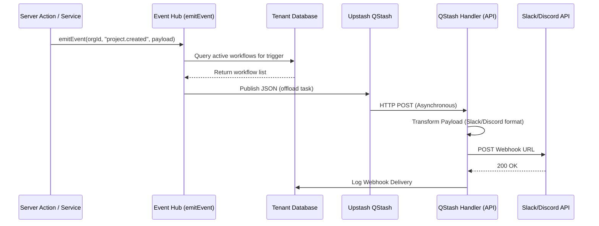

# Phase 20: External Connectors Technical Documentation

## Overview
Phase 20 introduces a robust, asynchronous connectivity ecosystem that allows organizations to receive rich notifications in Slack and Discord based on system events.

The system is built on three pillars:
1.  **Managed Connectors**: Pre-authenticated or webhook-based links to external platforms.
2.  **Workflow Engine**: A mapping layer that connects "Triggers" (system events) to "Actions" (deliveries).
3.  **Reliable Delivery**: Powered by Upstash QStash for asynchronous processing, retries, and high availability.

## 🏗️ Architecture

## 🗄️ Database Schema (Tenant-Side)

The connectivity system operates strictly within the tenant-isolated schema:

- **`connectors`**: Stores the target platform configuration (e.g., Slack Webhook URL).
- **`workflows`**: The "if-this-then-that" logic. Links a trigger (e.g., `project.created`) to a connector or custom URL.
- **`webhook_deliveries`**: Historical log of every attempt made by the system, including response status and duration.

## 🔗 Supported Platforms

### Slack
Uses **Slack Block Kit** for rich messages.
- Header with event-specific emoji.
- Section with detailed description.
- Context with timestamp and branding.

### Discord
Uses **Discord Embeds**.
- Colored sidebars based on event severity.
- Fields for structured data (e.g., Project Name, Creator).
- Footer for branding.

## ⚡ Event Flow & Transformation

1.  **Emission**: Code calls `emitEvent` in `src/lib/events.ts`.
2.  **Dispatch**: The hub finds matching workflows and calculates the `targetUrl`.
3.  **Queueing**: Data is pushed to QStash to avoid blocking the main user request.
4.  **Handling**: The `qstash-handler` route (`/api/webhooks/qstash-handler`) receives the task.
5.  **Transformation**: The `transformer.ts` logic converts the generic payload into the rich format required by the destination.

## 🛡️ Security & Reliability

- **Signature Verification**: The QStash handler verifies signatures to ensure requests only come from authorized QStash workers.
- **Tenant Isolation**: Every database query and log entry is scoped to the specific organization using `withAdminTenantDb`.
- **Retries**: QStash automatically handles retries if the external service (Slack/Discord) is down.
- **Audit Logging**: Creation and deletion of connectors/workflows are recorded in the central audit log.

## 📝 Configuration

Environment variables required:
- `QSTASH_TOKEN`: API key for publishing.
- `QSTASH_CURRENT_SIGNING_KEY` / `QSTASH_NEXT_SIGNING_KEY`: For signature verification.
- `NEXT_PUBLIC_APP_URL`: Base URL for the callback handler.
