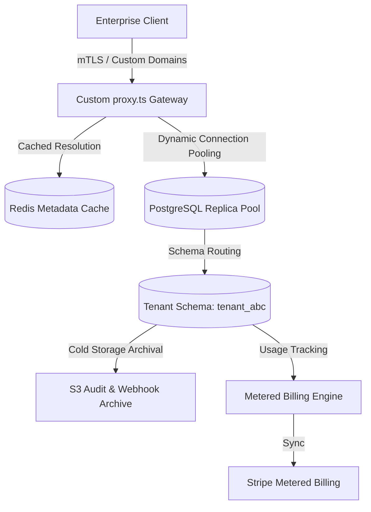

# Milestone Proposal: v11.0 (Enterprise Federation, Metering & Elastic Scalability)

> [!IMPORTANT]
> This proposal outlines the strategic direction for Milestone v11.0 of the Multi-Tenant SaaS platform. It builds upon the integration ecosystem established in v10.0 and introduces critical capabilities for scale, enterprise data governance, and metered billing.

---

## 🎯 Executive Summary
As the platform expands its B2B capabilities (OAuth marketplaces, automation, and digests in v10.0), Milestone v11.0 shifts the focus toward **enterprise compliance, usage-based monetization, and elastic database scalability**. 

The main objective is to transition from static tenant boundaries to a highly scalable, self-regulating SaaS environment capable of supporting enterprise tenants with complex integration, billing, and isolation requirements.

---

## 🗺️ Core Architecture Themes

---

## 🚀 1. Enterprise-Grade Features

### 💎 Usage-Based Billing & Metering Engine
Transition the platform from static pricing tiers to granular, usage-based consumption models.
*   **High-Throughput Metering**: Build a stateless, non-blocking telemetry collector that records events (API calls, workflow triggers, webhook deliveries) in Redis buffers before flushing in batches to PostgreSQL.
*   **Stripe Metered Billing Sync**: Automatically sync accumulated tenant consumption metrics to Stripe Subscription Items at regular intervals.
*   **Granular Quota Thresholds**: Expose real-time consumption graphs in the tenant console and trigger Slack/Email alerts at 80% and 100% of limits before applying soft-blocks.

### 🔌 Tenant-Scoped Webhook Enhancements & Mutual TLS (mTLS)
Expand the webhook system to support enterprise security requirements.
*   **mTLS Handshake**: Allow enterprise tenants to upload custom client certificates for webhook delivery, enabling mutual TLS verification.
*   **Custom Webhook Headers**: Provide a UI for tenants to inject custom headers (e.g., custom auth keys, signature formats) into outgoing webhook payloads.
*   **Self-Service Replay**: Allow tenants to view detailed webhook delivery logs and manually trigger single or bulk retries directly from their dashboard.

### 📦 Self-Service Tenant Data Portability (Import/Export)
Fulfill enterprise requirements for data residency and vendor lock-in mitigation.
*   **Schema SQL/JSON Export**: Build a secure exporter that packages the tenant's isolated database schema structure and records into a single encrypted ZIP file.
*   **Guided Data Importer**: Provide a CSV/JSON import wizard mapping external data models to the tenant's `projects` and custom role configurations with transactional safety and rollback on failure.

---

## ⚡ 2. Scalability & Performance Optimizations

### 🏎️ Write-Through Redis Cache Layering
Reduce database pressure during high-throughput requests by caching common lookup data.
*   **Proxy-Level Metadata Caching**: Cache custom domains, tenant schema mappings, active SSO configurations, and API key hashes in Upstash Redis.
*   **Write-Through / Eviction Strategy**: Update the cache on tenant settings changes, and use TTLs combined with explicit key invalidation to keep the cache consistent.
*   **Local In-Memory Backup**: Maintain a short-lived local memory cache within the proxy to minimize Upstash Redis latency for critical routing lookups.

### 🗄️ Cold Storage Archival & Log Tiering
Mitigate PostgreSQL database bloat caused by high-volume audit logs and webhook delivery entries.
*   **Automated Archival Pipeline**: Create a weekly background job that packages webhook delivery histories and audit logs older than 90 days into compressed JSON files and uploads them to S3-compatible cold storage.
*   **Pruning & Stubbing**: Delete archived database rows, leaving a clean "archive stub" pointing to the S3 bucket path for retrieval in the audit interface.

### 🌀 Zero-Downtime Dynamic Tenant Migration Pipeline
Optimize the CLI schema migration logic (`db:migrate-tenants`) into a robust, rolling system.
*   **Concurreny & Batching**: Support migrating tenant schemas in parallel batches with configurable concurrency controls to prevent database lock contention.
*   **Pre-Flight Drifting Checks**: Validate that the active schema structure matches expected versions before attempting DDL executions.

---

## 🔒 3. Technical & Security Enhancements

### 🛡️ CSP Enforcement & Subresource Integrity (SRI)
Transition the Content Security Policy (CSP) from `Report-Only` to `Enforce` mode.
*   **Strict CSP**: Lock down script, style, connect, and frame sources.
*   **Dynamic Nonce Generation**: Pass cryptographically secure nonces to Next.js scripts and style tags dynamically on every request.
*   **SRI Script Validation**: Ensure Next.js builds generate integrity hashes for all client-side script chunks to block man-in-the-middle asset injections.

### 🧬 Type-Safe Dynamic SQL Query Builder
Improve developer productivity and type safety when dealing with multiple tenant schemas.
*   **Dynamic Schema Drizzle Wrapper**: Build a utility helper that automates prepending the search path or dynamically switching schema targets using Drizzle's dynamic query builder APIs.
*   **Local Development Emulator**: Provide local mocks for Upstash QStash, Resend, and Stripe endpoints to allow developers to build features without internet dependencies.

### 📊 Schema Drift Detector
*   **Verification Engine**: Implement a daily cron task that queries the PostgreSQL system catalog (`information_schema`) for all tenant schemas, comparing them against the default canonical schema.
*   **Alerting**: Report missing columns, incorrect indexes, or manual table modifications directly to Sentry and the system dashboard.

---

## 📅 Proposed Phase Breakdown

| Phase | Title | Goal | Key Deliverables |
|---|---|---|---|
| **Phase 42** | **Strict CSP Enforcement & SRI** | Harden the security posture to compliance-ready status. | Enforced CSP, dynamic nonces, asset integrity verification. |
| **Phase 43** | **Write-Through Resolution Cache** | Optimize proxy routing and eliminate redundant database queries. | Redis caching for domains, SSO configs, and API keys. |
| **Phase 44** | **Metered Billing & Telemetry** | Enable flexible B2B usage-based billing structures. | Non-blocking telemetry collector, Stripe sync worker. |
| **Phase 45** | **Self-Service Import, Export & Replay** | Enhance developer platform control and data portability. | Webhook replayer, encrypted schema exporter, data mapping importer. |

---

## 🧪 Verification & Testing Strategy

### 1. High-Concurreny Performance Tests
*   Run simulation scripts that trigger hundreds of concurrent API calls per second to verify the write-through cache hits, proxy circuit breakers, and connection pool stability.

### 2. E2E Compliance Auditing
*   Utilize Playwright to test CSP violation handlers and ensure no inline styles or unauthorized scripts execute.
*   Test data export workflows to verify the generated ZIP files contain valid, parsable data matching the tenant's exact database state.

### 3. Isolation Integrity Audits
*   Verify that custom dynamic queries cannot break out of their tenant schemas (`search_path`) even when running raw SQL statements or malformed parameters.
